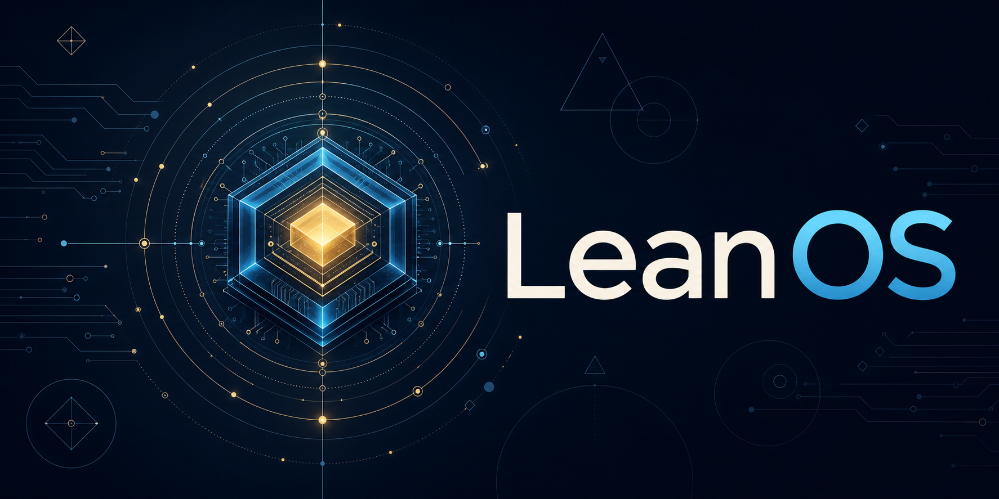
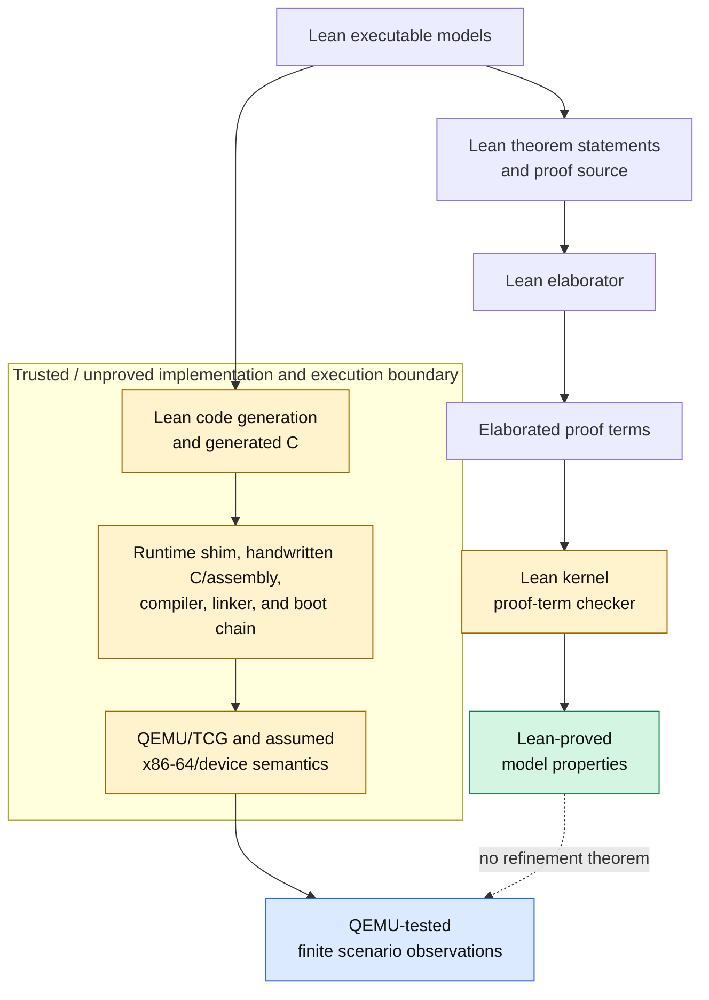

# LeanOS



LeanOS is an experiment in building a small operating-system kernel whose
implementation, executable specification, and machine-checked proofs evolve
together in Lean 4.

The project is an **experimental research prototype**, not a verified operating
system. It now builds bootable x86-64 images, exercises several deterministic
machine scenarios under QEMU, and checks a growing set of Lean models and
theorems. Those are different kinds of evidence: the theorems apply to the
models, while QEMU tests selected compiled integration paths.

## Current status

The evidence paths meet in the repository, but they do not carry the same
claim. In particular, the compiled path crosses a trusted, unproved boundary:



The dashed edge marks the missing model-to-binary refinement theorem; it does
not turn the QEMU observations into proof. Trusted coloring covers both the
Lean kernel assumed to check elaborated proof terms soundly and the unproved
implementation/execution path whose correctness is assumed when interpreting
the tested observations. The elaborator constructs proof terms, but the kernel
rechecks those terms rather than trusting the elaborator's result directly.

### QEMU-tested behavior

The CI image boots headlessly on a single emulated x86-64 `q35` CPU under TCG.
Success requires an exact serial transcript, a guest debug-exit signal, and
completion within a fixed timeout; merely reaching the kernel or printing a
partial log does not pass. The executable scenarios currently include:

- the default two-subject, two-address-space blocking-IPC path, from B blocking
  on an empty endpoint through A's send/wake to exact delivery back to B;
- a bounded preemption path with two PIT interrupts, separate saved contexts,
  CR3 changes, a switch from A to B, and resumption of A's original frame;
- an independent user-fault containment path that terminates A through the
  typed composite dispatch contract and resumes B in B's owned address space;
- boot-time memory-map validation, reservation, frame scrubbing and publication,
  live page-table checks, WP/SMEP/SMAP probes, and bounded user-copy checks;
- a dedicated double-fault IST fail-stop probe and a mapped-guard negative;
- a controlled fast-entry machine-state relaxation that must be caught by the
  live outbound MSR read-back before CPL3; and
- a bounded suite of deliberately corrupted user-return images that must fail
  with their expected typed rejection before reaching CPL3.

Before the main machine path, the normal images also replay the same bounded
183-vector [model-oracle corpus](docs/model-oracle.md) evaluated by Lean and by
hosted generated C. These finite QEMU runs provide reproducible integration
evidence for the named scenarios. They are not exhaustive tests, hardware
qualification, or proofs that the binary refines the Lean models.

### Lean-proved properties

The default Lake target builds the kernel reference models and their
machine-checked proofs. The proved surface includes, among other properties,
deterministic kernel transitions, invariant and well-formedness preservation,
capability-authority provenance, exclusive frame ownership, page-table
separation, syscall confinement, fail-stop absorption, user-return confinement,
and finite scheduled observer isolation. The
[security claim index](docs/security-claims.md) is the canonical summary of
advertised theorem statements, assumptions, and exclusions.

Every such result is a theorem about its named Lean state, transition, and
assumptions. Unless an explicit refinement theorem is added, it says nothing by
itself about generated C, handwritten boot code, QEMU execution, or physical
hardware.

### Proof and evidence enforcement

`./scripts/check.sh` builds every default Lean module with warnings as errors,
checks the security-claim index against independently typed contract theorems,
replays the generated-C oracle, runs boundary and host-harness regressions, and
requires deliberately invalid or weakened proof fixtures to remain rejected.
It also rejects `sorry`, `admit`, and unapproved `axiom`, `constant`, `unsafe`,
`extern`, or FFI declarations in project Lean sources. CI runs that gate before
building and booting the images, then retains the image, ELF, map, generated
page-table plans, tool versions, and serial evidence for inspection.

These checks protect the repository's stated proof discipline; they do not
verify Lean's kernel, the code generator, the C compiler, or the resulting
machine code.

### Trusted and tested boundaries

The current trusted computing base still includes handwritten assembly and C,
the restricted Lean runtime shim, Lean code generation and generated C, the C
compiler and binutils, linker scripts, GRUB, SeaBIOS, QEMU/TCG, host-side
evidence scripts, and the assumed x86-64 and device semantics. The boot scenarios
test only the fixed single-core paths and adversarial cases documented by their
ADRs. General concurrency, DMA, timing and covert channels, arbitrary hardware,
arbitrary faults, and full implementation refinement remain outside the current
claims. [ADR 0001](docs/adr/0001-phase-1-scope-threat-model-and-tcb.md) defines
the evidence vocabulary and baseline boundary; later ADRs record each addition.

## Why LeanOS?

Projects such as seL4 show the value of connecting a kernel implementation to a
formal model. LeanOS explores how much of that connection can live in one Lean
4 codebase:

- executable models beside the theorems that constrain them;
- small kernel interfaces with explicit preconditions and postconditions;
- proof-carrying changes checked on every pull request;
- emulator tests that connect abstract claims to a bootable artifact; and
- a documented trusted computing base (TCB), including every unverified bridge
  between Lean, generated code, the runtime, the linker, and hardware.

This is a research project, not a claim that writing code in Lean automatically
makes an operating system verified. Compiler correctness, runtime behavior,
foreign code, boot code, device models, and hardware assumptions all matter.
Making those boundaries visible is part of the work.

## Project principles

1. **State claims precisely.** Every advertised guarantee must name its model,
   assumptions, proof, and executable boundary.
2. **Keep the TCB small and visible.** Unverified assembly, C, firmware, tools,
   and runtime components are tracked rather than hidden behind “verified.”
3. **Prove vertical slices.** Prefer a tiny path from specification to booted
   behavior over a broad collection of disconnected theorems.
4. **Test the boundary.** Proofs cover models; QEMU and hardware tests cover the
   integration points where those models meet reality.
5. **Reproduce everything.** Pin toolchains and make local and CI commands use
   the same scripts.

## Boot and model progress

The first vertical-slice milestone is now implemented as a deterministic,
headless QEMU boot that:

1. loads a versioned x86-64 image;
2. initializes the minimum required runtime;
3. prints a known message over the serial console;
4. exercises one Lean-specified kernel state transition;
5. exits QEMU with a machine-readable success code; and
6. is built, proved, booted, and checked by GitHub Actions.

The selected boundary uses a minimal assembly/C loader around restricted,
allocation-free generated C from Lean. That bridge is deliberately small and
tested, but remains part of the TCB rather than a proved refinement layer.

The target platform, Phase 1 threat model, proof vocabulary, allowed milestone
claims, and initial trusted computing base are fixed in
[ADR 0001](docs/adr/0001-phase-1-scope-threat-model-and-tcb.md). In particular,
successful compilation or QEMU execution is integration evidence, not proof of
the generated binary or boot chain.

[ADR 0002](docs/adr/0002-freestanding-lean-boundary.md) selects a restricted,
allocation-free generated-C export for the first Lean/boot boundary and records
the reproducible experiments and trusted assumptions behind that decision.

The Phase 1 image can be built with `./scripts/build-image.sh` and exercised
headlessly with `./scripts/run-image.sh`; the stable protocol, pinned reference
tools, debug artifacts, and added trusted boundary are documented in
[the boot-image guide](docs/boot-image.md).

The first Phase 2 executable boundary boots one deliberately tiny ring-3
subject through an `int 0x80` gate, binds its calls to kernel-selected context,
and contains one expected user page fault. Its assumptions and evidence are
recorded in [ADR 0003](docs/adr/0003-ring3-syscall-fault-slice.md).

The two-subject integration slice extends that boundary with separate page
tables and a fixed cooperative handoff through one directional endpoint. Its
tested behavior and unproved machine boundary are recorded in
[ADR 0004](docs/adr/0004-two-subject-ipc-slice.md).

The [one-shot timer slice](docs/adr/0005-one-shot-timer-preemption.md) uses a
documented PIT interrupt to preempt a non-yielding subject and tests the
scheduler-derived caller/address-space switch to the second subject.

The [bounded SMAP copy slice](docs/adr/0006-smap-user-copy-window.md) composes
whole-range user-copy validation with an explicit AC window and exercises one
fixed boot syscall. Its Lean results are model-level; the assembly window and
machine behavior remain trusted and integration-tested.

The first executable model is `LeanOS.KernelTransition.transition`, with
machine-checked determinism, invariant-preservation, and rejection-stability
theorems in
[`LeanOS/KernelTransition.lean`](LeanOS/KernelTransition.lean). The boot-slice
[issue #6](https://github.com/rudi-cilibrasi/leanos/issues/6) must invoke the
exact fixed-width export `LeanOS.KernelTransition.bootTransition` (C symbol
`leanos_boot_transition`) and test its encoded accepted and rejected results.
That adapter is proved to agree with the model for well-formed encoded states;
the generated code and boot boundary remain trusted rather than proved.

The first capability-security reference model is documented in
[`docs/capability-model.md`](docs/capability-model.md). Its Lean theorems prove
well-formedness preservation, state-preserving rejection, and authority
provenance for a minimal copy/revoke operation set. These are model-level
properties, not claims about information flow, covert channels, concurrency,
object lifetimes, generated code, or a kernel binary.

Holder-visible [generation-bound capability handles](docs/capability-handles.md)
pair each bounded subject-local slot with its never-reused capability identity,
so clearing or replacing a slot cannot make an old handle authorize the new
occupant.

The finite [user extended-state denial model](docs/extended-state-denial.md)
requires an explicit fail-closed CR0/CR4 policy before modeled user return and
confines typed x87/MMX/SIMD denial to the authoritative current subject. Its
cleanup transition reuses the scheduler, lifecycle, mapping/TLB, and resumable
context state, then selects only a kernel-owned peer context or typed idle.
Machine exception delivery and cleanup/restore remain trusted integration work
rather than theorem claims.

The finite [PCI DMA-quarantine model](docs/dma-quarantine.md) validates a
versioned q35 manifest and proves, under an explicit device-control contract,
that a named present unassigned function cannot change physical memory,
allocator ownership, page-table or kernel-owned frames, kernel state, or any
subject-visible bytes. The guest also exhaustively checks that manifest after
firmware, clears bus mastering on every present function, and reads each
Command register back before CPL3. PCI enumeration and Command-register
semantics, QEMU/device obedience, the handwritten C adapter, and final-binary
correspondence remain trusted/tested boundaries rather than proof claims.

The bounded [direct-port-I/O authority model](docs/direct-port-io.md) separates
untrusted port/value words from kernel-selected purpose, models the selected
IOPL-zero and deny-all TSS I/O-map controls, and proves that user-origin
requests preserve the identical complete device projection. Typed kernel
acceptance is confined to exact serial, PIC, PIT, and debug-exit manifest keys
including direction and width. TSS loading, x86 privilege and exception
semantics, device behavior, generated code, and the final binary remain outside
these model-level claims.

The finite [fast privilege-entry control model](docs/privilege-entry-control.md)
admits only the manifest-backed `int 0x80` system-call mechanism, requires a
kernel-produced and read-back EFER/fast-entry-MSR denial tuple, composes the
extended-state control snapshot, and confines normalized raw alternate-entry
denials to the authoritative current subject. CPUID/MSR access, instruction and
exception semantics, assembly, QEMU, and the final binary remain trusted or
tested boundaries rather than theorem claims.

The physical-frame allocator reference model and its representation,
complexity, initialization assumptions, proved invariants, and capability
ownership boundary are documented in
[`docs/frame-allocator.md`](docs/frame-allocator.md).

The bounded [Multiboot2 memory-map model](docs/boot-memory-map.md) validates a
typed handoff, conservatively normalizes page intervals, proves usable-frame
soundness, and refines its output into the physical-frame allocator.

The [boot-reservation overlay](docs/boot-reservations.md) checks a finite
boot-artifact manifest and gives its frames unconditional precedence before
allocator initialization.

The [boot-time allocation slice](docs/boot-allocation.md) preserves and checks
the Multiboot2 handoff, reserves live boot artifacts, scrubs one bounded
identity-mapped frame, and publishes it only after the exact QEMU trace records
completion.

The first composition of capability authority with frame ownership uses
never-reused object identifiers to prove safe release and reuse; its lifetime
rule, machine-checked guarantees, executable attacks, and limits are documented
in [`docs/memory-lifecycle.md`](docs/memory-lifecycle.md).

Fixed boot-admitted [per-subject frame budgets](docs/frame-budgets.md) partition
eligible allocator frames, charge allocation to trusted kernel context, preserve
credit exactly across release and termination, and prove that a peer with an
available commitment can allocate independently of another subject's exhaustion.
Capability delegation does not transfer or duplicate the original charge.

The executable virtual-mapping model adds subject-owned address spaces,
capability-bounded read/write mappings, live translation checks, and stale
mapping invalidation. Its policy, proved scope, examples, and limitations are
documented in [`docs/virtual-mapping.md`](docs/virtual-mapping.md).

The executable [x86-64 page-table refinement model](docs/x86-page-tables.md)
encodes that policy into a constrained 4 KiB, four-level paging subset and
proves structural validity, permission non-amplification, current-frame
agreement, NX enforcement, and cross-address-space separation. Hardware walks,
CR3/TLB operations, boot integration, and the compiler remain trusted.

The finite [single-core TLB model](docs/tlb-model.md) makes invalidation atomic
with mapping/lifecycle mutation and revalidates cached translations against the
current encoded walk and allocator ownership before use.

The first total syscall model separates trusted caller/active-address-space
context from untrusted fixed-width scalar words and proves invariant
preservation, rejection stability, and caller confinement. Its vocabulary and
trust boundary are documented in [`docs/syscall-model.md`](docs/syscall-model.md).

The endpoint IPC model provides capability-authorized, capacity-one,
nonblocking mailboxes with trusted sender provenance, never-reused endpoint
identities, and complete destruction cleanup. Its precise proof boundary and
exclusions are documented in [`docs/endpoint-ipc.md`](docs/endpoint-ipc.md).

The [blocking-IPC boot slice](docs/adr/0009-blocking-ipc-boot.md) exercises a
causal B-block, A-send/wake, trusted redispatch, and exact delivery across the
Lean adapter, hosted oracle, generated freestanding code, and QEMU.

The bounded [capability-transfer model](docs/capability-transfer.md) attaches
at most one sealed, attenuated descendant to an endpoint envelope and installs
it atomically on receipt without interpreting payload words as authority.

The bounded [user-copy model](docs/user-copy.md) prevalidates a small complete
range through current virtual mappings before changing typed kernel buffers or
live-frame byte memory, with explicit alias rejection and atomic failure.

The [frame-scrubbing model](docs/frame-scrubbing.md) atomically clears reused
frame contents before publishing a fresh memory-object lifetime and proves
modeled reads cannot expose an earlier owner's bytes before the new owner
writes.

The [subject-lifecycle model](docs/subject-lifecycle.md) gives subjects
never-reused identities and defines atomic termination cleanup across held
capabilities, exclusively owned memory, address spaces, endpoints, pending
provenance, and runnable/current state. Its creation operation publishes a
fresh identity; it does not inherit or duplicate another subject's state.

The bounded [model-oracle corpus](docs/model-oracle.md) is evaluated in Lean
and replayed through hosted generated code and every boot-reachable adapter.
This differential check detects integration mismatches; it is not compiler or
binary verification.

The [interrupt model](docs/interrupt-model.md) gives the initial page-fault,
timer, and syscall vector vocabulary, proves origin-sensitive dispatch and
whole-subject user-fault containment, and records the unproved x86 entry and
return boundary.

The atomic [user-fault dispatch model](docs/fault-dispatch.md) composes the
normalized CPL3 page-fault record with the authoritative lifecycle, scheduler,
resumable-context, mapping, and TLB state. It terminates exactly the kernel-owned
current subject and returns either the deterministic survivor context or typed
idle without exposing partial cleanup. Terminal outcomes retain the exact
typed inbound rejection cause, with separate kernel-origin and already-halted
classes, while changing only the halt latch.

The bounded inbound entry manifest and total trap-frame normalizer bind those
ordinary gates to explicit x86 raw shapes and kernel-owned subject, address
space, CR3, stack, purpose, and nested-entry state before a boot handler runs.

The [fail-stop model](docs/fail-stop.md) adds an irreversible execution latch,
bounded double-fault escalation, and one absorbing gate for every modeled
post-fatal mutation and context-restoration path.

The [double-fault IST slice](docs/adr/0007-double-fault-ist.md) installs a
dedicated guarded stack for vector 8 and exercises one deterministic QEMU
fail-stop path. This is machine-integration evidence, not proof of x86
exception delivery or of the resulting binary.

The [observer-relative isolation model](docs/observation-model.md) defines a
subject's authorized view and proves scoped one-step low-equivalence and equal
visible replies for unrelated sequential operations over disjoint actor-local
memory. Authorized IPC and aliased shared memory/capabilities, global resource
exhaustion, and visible scheduling are explicit
channels; this is not a binary-level or timing-sensitive confidentiality claim.

The [finite scheduled observer-isolation model](docs/scheduled-observation.md)
composes that view with the bounded scheduler and proves a
termination-insensitive paired finite-prefix theorem with explicit public
channels and silent-step stuttering. It remains a Lean model result, not a
refinement claim for the boot slices or machine code.

The [security claim index](docs/security-claims.md) collects the stable,
machine-checked propositions that form the currently advertised proof surface,
including their assumptions, evidence classes, and explicit exclusions.

## Verification targets

These are long-term directions, not claims that the completed slices satisfy an
entire verification target. Work lands incrementally with an explicit threat
model and proof statement.

- **Functional correctness:** kernel operations refine a small abstract state
  machine and satisfy documented API contracts.
- **Capability safety:** authority is explicit, unforgeable in the model, and
  cannot be amplified by kernel operations.
- **Isolation and information flow:** subjects cannot observe or modify state
  outside their authority, modulo documented channels and assumptions.
- **Memory safety:** allocation, mapping, and object lifetimes preserve
  separation and ownership invariants.
- **Crash and recovery behavior:** persistent operations have specified atomic
  outcomes under modeled interruption.
- **Liveness and resource bounds:** selected operations terminate and critical
  resources have enforceable limits.
- **Boot integrity:** measured artifacts correspond to reviewed sources and a
  documented build process.

## CI strategy

GitHub-hosted Linux runners can run QEMU without hardware acceleration. That is
slower than KVM but suitable for a small, deterministic boot-smoke test.

CI will grow in layers:

| Layer | Gate | Status |
| --- | --- | --- |
| Repository | Markdown and repository hygiene | Active |
| Lean | Build all modules and check proofs with a pinned toolchain | Active |
| Host tests | Generated-C oracle and boundary/harness regressions | Active |
| Emulator | Build and boot headlessly with timeout and serial assertions | Active |
| Artifacts | Preserve image, ELF, map, checksums, versions, and serial log | Active |
| Release | Publish tagged reproducible images with provenance | Active |

Emulator CI should invoke one repository-owned script, use an explicit timeout,
capture the serial console, and require a guest success signal. A process that
merely stays alive or prints part of a boot log is not a passing test.

There is no deployment target yet, so continuous deployment would be premature.
Once a bootable artifact exists, tagged releases can publish images and build
provenance; real-hardware deployment should remain a separate, opt-in test lane.

### Lean development

Install [Elan](https://github.com/leanprover/elan), then run the repository-owned
check from the repository root:

```sh
./scripts/check.sh
```

Elan reads `lean-toolchain` and installs the exact Lean release automatically.
The check builds every default Lake target and verifies that the deliberately
invalid proof fixtures remain rejected. Lean warnings are errors for project
modules, so declarations containing `sorry` or `admit` fail the build. The
check also rejects unapproved `axiom`, `constant`, `unsafe`, and `extern`
declarations; required trusted-code boundaries must be documented and explicitly
allowlisted when they are introduced. GitHub Actions invokes the same script;
generated Lake output is kept under the ignored `.lake/` directory.

### Local CI commands

The pull-request workflow uses only these repository-owned entry points:

```sh
./scripts/check-markdown.sh
./scripts/check.sh
./scripts/build-image.sh
./scripts/record-tool-versions.sh
./scripts/run-emulator-evidence.py run
```

The first command requires Node.js/npm. Image building and QEMU prerequisites,
the exact Ubuntu 24.04 package versions used in CI, and emulator resource bounds
are listed in [the boot-image guide](docs/boot-image.md). CI first runs the
Markdown and complete Lean proof-integrity gates, then builds once and executes
the versioned mandatory emulator matrix without KVM. The matrix is the sole
release-blocking QEMU inventory for pull requests and tags. CI retains images,
debug ELFs, symbol maps, checksums, pinned tool versions, serial logs, exact
commands, and the machine-readable evidence report for 14 days, including
available diagnostics from failed runs. Controlled negative fixtures ensure
theorem, compiler, matrix-inventory, artifact-hash, serial-protocol,
guest-signal, and timeout failures cannot pass.

Tags matching `vMAJOR.MINOR.PATCH` additionally run that same matrix, require a
byte-identical double build, and publish its evidence manifest with checksums
and GitHub provenance. The version policy,
artifact inventory, trusted-boundary warning, and download verification
commands are in [the boot-image guide](docs/boot-image.md).

## Roadmap

### Phase 0: foundations

- define the scope, threat model, target platform, and proof vocabulary;
- pin Lean, Lake, QEMU, linker, and cross-compilation dependencies;
- test the freestanding Lean/runtime boundary and record the architecture
  decision; and
- establish local commands that CI invokes without duplicating build logic.

### Phase 1: proved boot slice

- create a minimal bootable image and serial-console protocol;
- define the first abstract kernel state and operation;
- prove its key invariants and connect it to the boot demo; and
- run proof, build, and QEMU smoke checks on every pull request.

### Phase 2: capability microkernel core

- introduce kernel objects, capabilities, and address spaces;
- specify and prove authority-preservation properties;
- add memory allocation, mapping, IPC, and syscall boundaries one slice at a
  time; and
- expand adversarial model tests and emulator scenarios.

### Phase 3: system services

- move policy into isolated user-space services;
- explore verified storage, networking, and recovery components; and
- add hardware-backed test lanes without weakening deterministic QEMU CI.

Process duplication is deliberately excluded from this roadmap. LeanOS does
not promise `fork()`, a fork syscall, or a clone-like operation with implicit
inheritance. [ADR 0010](docs/adr/0010-defer-fork.md) defines the whole-kernel
readiness gate. Any future implementation must begin with a new architecture
issue that closes every item in that gate before defining a model, ABI,
adapter, or boot path.

## Contributing

The initial backlog is maintained in
[GitHub Issues](https://github.com/rudi-cilibrasi/leanos/issues). Before opening
a pull request:

1. link the issue or design question the change addresses;
2. distinguish proved properties from tested behavior;
3. document any new TCB assumption or unverified boundary;
4. run the same repository scripts used by CI; and
5. keep the change to one reviewable vertical slice.

Architecture-changing work should begin with a short issue or decision record.
Proofs are part of the implementation: changes that invalidate them should fix
or deliberately revise the associated specification in the same pull request.

## Reading the evidence

Use the [security claim index](docs/security-claims.md) for the current proved
surface, the accepted [architecture decisions](docs/adr/) for scenario-specific
claims and TCB additions, and the [boot-image guide](docs/boot-image.md) for
reproduction commands and exact QEMU evidence. LeanOS should continue to be
described as an experimental research project rather than a verified operating
system.
