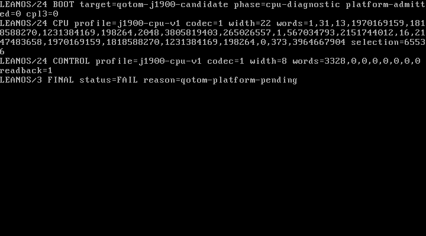

# QEMU early text console observations

These are synthetic QEMU TCG observations, not Qotom hardware evidence.
The image was built from clean revision
`c06036aec84e619bb8d492137f3c7a9ea84fcd87`. `inputs.json` pins the image,
ELF, source and QEMU version. The later evidence commit does not change the
captured implementation.

Run `python3 scripts/test-boot-text-image.py build/boot/leanos-0.1.0-x86_64.iso`
after building that revision. The runner checks actual 4,000-byte text-cell
memory against serial text and reads the linked console state through QMP.
Commands retain their original local paths; temporary QMP sockets no longer
exist. PNG screenshots are lossless conversions of QEMU PPM screendumps.
`SHA256SUMS` covers every retained evidence file except itself and this note.

- `intel-text`: all CPU diagnostic records appear on screen, with the same
  serial bytes as the headless case. The terminal record deliberately reports
  `qotom-platform-pending`; it does not admit the platform.
- `intel-headless`: the console remains disabled, with CPU and MSR replay
  accepted and serial output intact.
- `q35-lifetime`: the canonical terminal success record is captured on serial,
  while only the initial BOOT text remains on screen. The display sink is
  disabled before PCI quarantine and root changes.

The standard `scripts/run-image.sh` also passed on the same built image.
These observations do not establish a Qotom EGA handoff, monitor detection,
a graphics framebuffer backend, or display safety after PCI quarantine.

